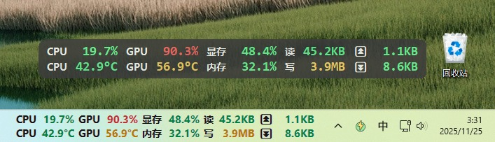

[中文文档](./README.md)

#  LiteMonitor

A lightweight and fully customizable **Windows hardware monitor** — track CPU, GPU, memory, disk, and network statistics in real time.

> 🟢 **Download latest version:**  
> [📦 GitHub Releases → LiteMonitor Latest](https://github.com/Diorser/LiteMonitor/releases/latest)  
> [💿 Download Website](https://litemonitor.cn/)

LiteMonitor is a modern **Windows desktop system monitoring tool**.  
It supports horizontal/vertical display, multiple languages, theme switching, transparency, adaptive DPI scaling, and three-level color alerts — in a clean and highly configurable interface.




###  🟢 **New Theme Editor**


---

# 🖥️ Monitoring Features

| Category | Metrics |
|-----------|----------|
| 💻 **CPU** | Real-time usage & temperature (multi-core average + peak). |
| 🎮 **GPU** | GPU usage, temperature, VRAM usage; supports NVIDIA / AMD / Intel. |
| 💾 **Memory** | RAM usage overview in percentage. |
| 📀 **Disk** | Read/Write throughput (KB/s, MB/s). Auto/manual disk selection supported. |
| 🌐 **Network** | Upload/Download speed with adaptive unit formatting. Auto/manual NIC selection supported. |

---

# Product Features

| Feature | Description |
|--------|-------------|
| 🎨 **Theme Customization** | JSON-defined colors, fonts, spacing, corner radius. New Theme System v2 with cleaner structure & scaling logic. |
| 🟥🟨🟩 **Three-Level Color Alerts** | Bars and values change colors based on thresholds; network/disk have independent logic. |
| 🌍 **Multilingual UI** | Supports 8 languages (ZH/EN/JA/KO/FR/DE/ES/RU). Switching languages updates UI instantly. |
| 📊 **Show/Hide Metrics** | Toggle CPU/GPU/VRAM/MEM/NET/DISK modules individually. |
| 🧮 **Horizontal Mode** | Brand-new two-row layout with per-column dynamic width, smart unit formatting, and automatic panel width calculation. |
| 📏 **Adjustable Panel Width** | Change width from menu; layout refreshes instantly. |
| 🔠 **UI Scaling (UIScale)** | Full DPI + user-defined scaling support; fonts and layout resize proportionally. |
| 🎞️ **Smooth Animations** | Numeric values transition smoothly; speed configurable. |
| 🪟 **Window Features** | Rounded corners, transparency, high-quality text rendering, always-on-top. |
| 🧭 **Auto Hide on Screen Edge** | Automatically collapses when docked to edges; reappears on mouse hover. Multi-monitor aware. |
| 🧲 **Clamp to Screen** | Prevents window from being dragged outside visible screen area. |
| 👆 **Click-Through Mode** | Allows mouse interactions to pass through the window. |
| 🎨 **Instant Theme/Language Switching** | No restart required; UI updates immediately. |
| 🔍 **Smart Value Formatting** | Automatic unit conversion, adaptive decimals; horizontal mode removes `/s`, trims decimals for large values. |
| 🔄 **Auto Update Check** | Silent background check on startup; popup only when triggered manually. |
| 🚀 **Auto Startup** | Uses Windows Task Scheduler (supports elevated run). |
| 📂 **Persistent Settings** | All preferences saved to `settings.json` in real time. |

---

## 📦 Installation

1. Download from [GitHub Releases](https://github.com/Diorser/LiteMonitor/releases)
2. Extract and run `LiteMonitor.exe`
3. The app automatically loads the correct theme & language

---

## 🌐 Multilingual Support

Language files are stored in `/resources/lang/`:

| Language | File |
|-----------|------|
| Chinese (Simplified) | `zh.json` |
| English | `en.json` |
| Japanese | `ja.json` |
| Korean | `ko.json` |
| French | `fr.json` |
| German | `de.json` |
| Spanish | `es.json` |
| Russian | `ru.json` |

---

## 🎨 Theme System

Themes are stored under `/resources/themes/` as JSON files.

Example:
```json
{
  "name": "DarkFlat_Classic",
  "layout": { "rowHeight": 40, "cornerRadius": 10 },
  "color": {
    "background": "#202225",
    "textPrimary": "#EAEAEA",
    "barLow": "#00C853"
  }
}
```

**Theme System v2 Improvements:**
- Unified layout fields  
- Separate scaling for layout (DPI×UIScale) and fonts (UIScale only)  
- Cleaner JSON structure, easier for custom themes  

---

## ⚙️ Settings (settings.json)

| Field | Description |
|--------|-------------|
| `Skin` | Current theme name |
| `PanelWidth` | Panel width (works in both modes) |
| `UIScale` | User interface scaling factor |
| `Opacity` | Window opacity (0.1–1.0) |
| `Language` | Active language |
| `TopMost` | Always-on-top |
| `AutoStart` | Run at system startup |
| `AutoHide` | Enable auto-hide on screen edges |
| `ClampToScreen` | Prevent dragging window outside visible screen |
| `ClickThrough` | Allow mouse pass-through |
| `RefreshMs` | Refresh interval |
| `AnimationSpeed` | Smooth animation speed |
| `HorizontalMode` | Horizontal/Vertical display |
| `PreferredNetwork` | Manual NIC selection (empty = auto) |
| `PreferredDisk` | Manual disk selection (empty = auto) |
| `Enabled` | Toggles for CPU/GPU/MEM/NET/DISK modules |

---

## 🧩 Architecture Overview

| File | Responsibility |
|------|----------------|
| `MainForm_Transparent.cs` | Window behavior, drag, menus, auto-hide, transparency |
| `UIController.cs` | Theme loading, DPI/UIScale scaling, layout rebuilds, rendering |
| `UIRenderer.cs` | Vertical-mode rendering (groups, bars, texts) |
| `HorizontalRenderer.cs` | Horizontal-mode rendering (two-row layout) |
| `UILayout.cs` | Dynamic vertical layout calculation |
| `HorizontalLayout.cs` | Column width and total panel width calculation |
| `ThemeManager.cs` | Load themes, parse colors, build fonts |
| `LanguageManager.cs` | Localization loader with flattened key access |
| `HardwareMonitor.cs` | Collects CPU/GPU/MEM/NET/DISK data; smart device auto-selection |
| `AutoStart.cs` | Manages Windows Task Scheduler startup task |
| `UpdateChecker.cs` | GitHub + China mirror version checking |
| `AboutForm.cs` | About dialog |

---

## 🛠️ Build Instructions

### Requirements
- Windows 10 / 11  
- .NET 8 SDK  
- Visual Studio 2022 / JetBrains Rider

### Build
```bash
git clone https://github.com/Diorser/LiteMonitor.git
cd LiteMonitor
dotnet build -c Release
```

Output:
```
/bin/Release/net8.0-windows/LiteMonitor.exe
```

---

## 📄 License
Released under the **MIT License** (free for personal & commercial use).

---

## 💬 Contact
**Author:** Diorser  
**GitHub:** https://github.com/Diorser/LiteMonitor

---

<!-- SEO Keywords: Windows hardware monitor, system monitor, desktop performance widget, traffic monitor alternative, CPU GPU temperature monitor, open-source hardware monitor, lightweight system widget, memory and network usage tracker -->
